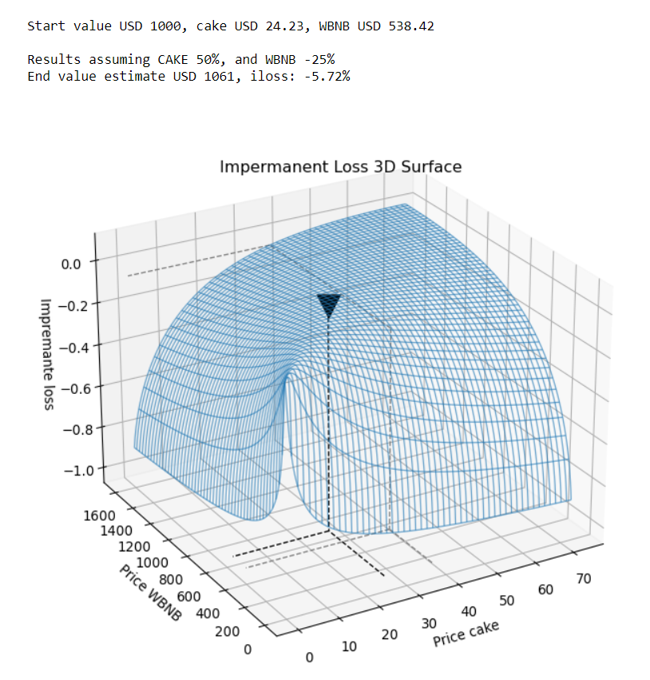

# Tools for use in DeFi

[link](#get-main-exchanges-for-a-coin-or-token) Main exchanges for one token


## Instalation


```sh
pip install defi
```


## Impermanent Loss

```python
import defi.defi_tools as dft

# Impermanent loss for stableCoin & -20% return token 
dft.iloss(0.8)
```
> -0.62%


```python
import defi.defi_tools as dft

# Impermanent loss for stableCoin & +60% return token 
dft.iloss(1.6, numerical=True)

```
> 0.027   # Same as 2.7%


## Buy&Hold vs Stake & Farming strategy


```python
import defi.defi_tools as dft

# Exercise: Get returns after 20 days, assuming token A is a stablecoin, token B perform + 150%
# individual staking pools for both = 0.01% & 0.05% daily
# liquidity-pool farming rewards =0.2% daily & Earn by fees/day = 0.01%
dft.compare(days=20, var_A=0, var_B=150, rw_pool_A=0.01, rw_pool_B=0.05, rw_pool_AB=0.2, fees_AB=0.01)
```

```json
{
 "buy_hold": "75.00%",
 "stake": "75.60%",
 "farm": "71.96%",
 "Best": "Stake"
}
```


## DeFi protocols


```python
import defi.defi_tools as dft

metadata, df = dft.getProtocol('Uniswap')
metadata
```

```json
{
 "id": "1",
 "name": "Uniswap",
 "address": "0x1f9840a85d5af5bf1d1762f925bdaddc4201f984",
 "symbol": "UNI",
 "url": "https://info.uniswap.org/",
 "description": "A fully decentralized protocol for automated liquidity provision on Ethereum.\r\n",
 "chain": "Ethereum",
 "logo": "None",
 "audits": "2",
 "audit_note": "None",
 "gecko_id": "uniswap",
 "cmcId": "7083",
 "category": "Dexes",
 "chains": ["Ethereum"],
 "module": "uniswap.js"
}
```


## Top 20 dapps TVL by chain

```python
import defi.defi_tools as dft
import matplotlib.pyplot as plt

df = dft.getProtocols()
fig, ax = plt.subplots(figsize=(12,6))
top_20 = df.sort_values('tvl', ascending=False).head(20)

chains = top_20.groupby('chain').size().index.values.tolist()
for chain in chains:
    filtro = top_20.loc[top_20.chain==chain]
    ax.bar(filtro.index, filtro.tvl, label=chain)

ax.set_title('Top 20 dApp TVL, groupBy dApp main Chain', fontsize=14)
plt.legend()
plt.xticks(rotation=90)
plt.show()
```


```python
import defi.defi_tools as dft
import pandas as pd

exchanges = ['pancakeswap', 'venus', 'uniswap','Compound', 'AAVE']

hist = [dft.getProtocol(exchange)[1] for exchange in exchanges]
df = pd.concat(hist, axis=1)
df.columns = exchanges
df.plot(figsize=(12,6))
```


## CoinGecko API

Endpoints available, some examples:

	* dft.geckoPrice("bitcoin,ethereum", "usd,eur,brl")
		# coinGecko quotes

	* dft.geckoList(page=1, per_page=250)
		# full coinGecko cyptocurrency list

	* dft.geckoMarkets("ethereum")
		# top 100 liquidity markets, prices, and more, for eth or other coin

	* dft.geckoHistorical('cardano')
		# full history containing price, market cap and volume 


### Examples

#### Get price for coins at diferent currencies
```python
import defi.defi_tools as dft

dft.geckoPrice("bitcoin,ethereum", "usd,eur,brl")
```

```json
{"ethereum": {"usd": 2149.85, "eur": 1807.58, "brl": 12208.77},
 "bitcoin": {"usd": 60188, "eur": 50606, "brl": 341802}}
```


#### Get main exchanges for a coin or token 
```python
import defi.defi_tools as dft

df = dft.geckoMarkets("ethereum")
print(df.info())
# returns top 100 ethereum quotes by volume
```
```text
Index: 100 entries, IDCM to FTX.US
Data columns (total 9 columns):
 #   Column       Non-Null Count  Dtype              
---  ------       --------------  -----              
 0   base         100 non-null    object             
 1   target       100 non-null    object             
 2   last         100 non-null    float64            
 3   volume       100 non-null    float64            
 4   spread       100 non-null    float64            
 5   timestamp    100 non-null    datetime64[ns, UTC]
 6   volume_usd   100 non-null    float64            
 7   price_usd    100 non-null    float64            
 8   trust_score  100 non-null    object             
dtypes: datetime64[ns, UTC](1), float64(5), object(3)
memory usage: 7.8+ KB
```


#### Get historical prices for a coin
```python
import defi.defi_tools as dft

df = dft.geckoHistorical('cardano')
print(df)
```
<pre>
                        price   market_caps  total_volumes
date                                                      
2017-10-18 00:00:00  0.026845  6.960214e+08   2.351678e+06
2017-10-19 00:00:00  0.026830  6.956220e+08   2.815156e+06
2017-10-20 00:00:00  0.030300  7.855800e+08   8.883473e+06
2017-10-21 00:00:00  0.028588  7.412021e+08   5.308857e+06
2017-10-22 00:00:00  0.027796  7.206698e+08   2.901876e+06
...                       ...           ...            ...
2021-04-13 00:00:00  1.319790  4.223483e+10   5.005258e+09
2021-04-14 00:00:00  1.422447  4.565529e+10   5.693373e+09
2021-04-15 00:00:00  1.456105  4.676570e+10   8.920293e+09
2021-04-16 00:00:00  1.478071  4.730118e+10   5.151595e+09
2021-04-17 03:47:55  1.433489  4.595961e+10   5.152747e+09

[1278 rows x 3 columns]
</pre>


## Pancake Swap

### Get tokens prices in real time
```python
import defi.defi_tools as dft

df = dft.pcsTokens()
print(df)
```
```text
                                                         name     symbol       price  price_BNB                 updated
0x0E09FaBB73Bd3Ade0a17ECC321fD13a19e81cE82  PancakeSwap Token       Cake     24.0636     0.0450 2021-04-17 04:29:08.332
0xbb4CdB9CBd36B01bD1cBaEBF2De08d9173bc095c        Wrapped BNB       WBNB    534.2575     1.0000 2021-04-17 04:29:08.332
0x0F9E4D49f25de22c2202aF916B681FBB3790497B             Perlin        PRL      0.2091     0.0004 2021-04-17 04:29:08.332
0xe9e7CEA3DedcA5984780Bafc599bD69ADd087D56         BUSD Token       BUSD      1.0000     0.0019 2021-04-17 04:29:08.332
0x7130d2A12B9BCbFAe4f2634d864A1Ee1Ce3Ead9c         BTCB Token       BTCB  62166.5517   116.3604 2021-04-17 04:29:08.332
...                                                       ...        ...         ...        ...                     ...
0xB6802C06A441BA63624751C53C7c0708b75F06EC          FinalMoon  FINALMOON      0.0651     0.0001 2021-04-17 04:29:08.332
0x2cF0DA1EB4165d73156CE1E32450e4A0E1c1791b        FairUnicorn       FUni      0.0000     0.0000 2021-04-17 04:29:08.332
0x5CeD26185f82B07E1516d0B013c54CcBD252A4Ad            Peaches      PEACH      0.1130     0.0002 2021-04-17 04:29:08.332
0x2bA64EFB7A4Ec8983E22A49c81fa216AC33f383A        Wrapped BGL       WBGL      0.1000     0.0002 2021-04-17 04:29:08.332
0x019bE1796178516e060072004F267B59a49A0801     Pepper Finance       PEPR      0.1819     0.0003 2021-04-17 04:29:08.332

[854 rows x 5 columns]
```


### Get pairs, liquidity, and more
```python
import defi.defi_tools as dft

pairs = dft.pcsPairs(as_df=False)
print(pairs)
```

```json
{"updated_at": 1618645355351,
 "data": {"0x0E09FaBB73Bd3Ade0a17ECC321fD13a19e81cE82_0xbb4CdB9CBd36B01bD1cBaEBF2De08d9173bc095c": 
 	{"pair_address": "0xA527a61703D82139F8a06Bc30097cC9CAA2df5A6",
	   "base_name": "PancakeSwap Token",
	   "base_symbol": "Cake",
	   "base_address": "0x0E09FaBB73Bd3Ade0a17ECC321fD13a19e81cE82",
	   "quote_name": "Wrapped BNB",
	   "quote_symbol": "WBNB",
	   "quote_address": "0xbb4CdB9CBd36B01bD1cBaEBF2De08d9173bc095c",
	   "price": "0.04503969270521829587",
	   "base_volume": "5473068.824002232134035221",
	   "quote_volume": "239997.1228321299572591638",
	   "liquidity": "1076144814.0632013827775993748053",
	   "liquidity_BNB": "2007551.221740467021401314"
	},
}
```


### Get token info
```python
import defi.defi_tools as dft
dft.pcsTokenInfo('cake')
```
```json
{"name": "PancakeSwap Token",
 "symbol": "Cake",
 "price": "24.03353223898417117634582253598019",
 "price_BNB": "0.04503467915973850237292527741402623"
}
```


### Get pair info
```python
import defi.defi_tools as dft
dft.pcsPairInfo('cake','bnb')
```

```json
{"pair_address": "0xA527a61703D82139F8a06Bc30097cC9CAA2df5A6",
 "base_name": "PancakeSwap Token",
 "base_symbol": "Cake",
 "base_address": "0x0E09FaBB73Bd3Ade0a17ECC321fD13a19e81cE82",
 "quote_name": "Wrapped BNB",
 "quote_symbol": "WBNB",
 "quote_address": "0xbb4CdB9CBd36B01bD1cBaEBF2De08d9173bc095c",
 "price": "0.04503969270521829587",
 "base_volume": "5473068.824002232134035221",
 "quote_volume": "239997.1228321299572591638",
 "liquidity": "1076144814.0632013827775993748053",
 "liquidity_BNB": "2007551.221740467021401314"
}
```


### Simulate LP invest
```python
import defi.defi_tools as dft
dft.value_f, iloss = dft.iloss_simulate('cake','bnb', value=1000, base_pct_chg=50, quote_pct_chg=-25)
```



## About

- twitter user @JohnGalt_is_www