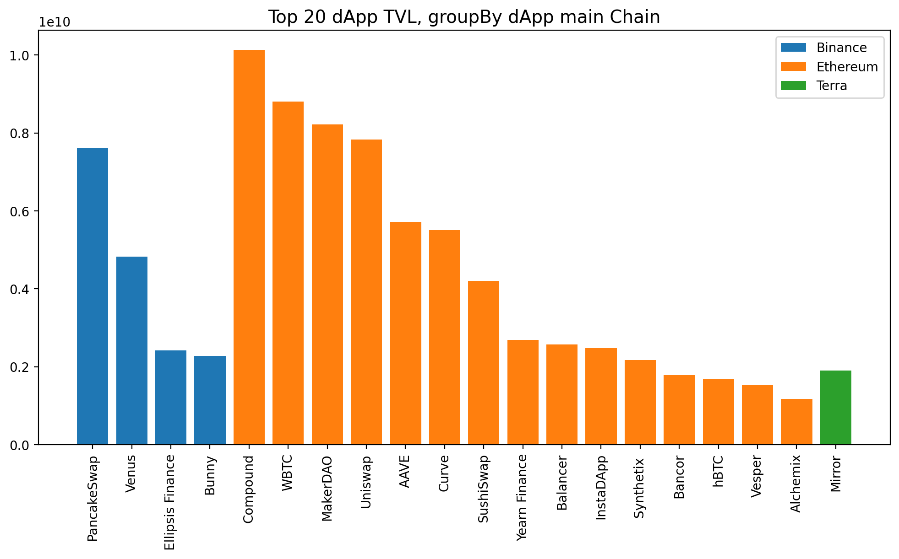
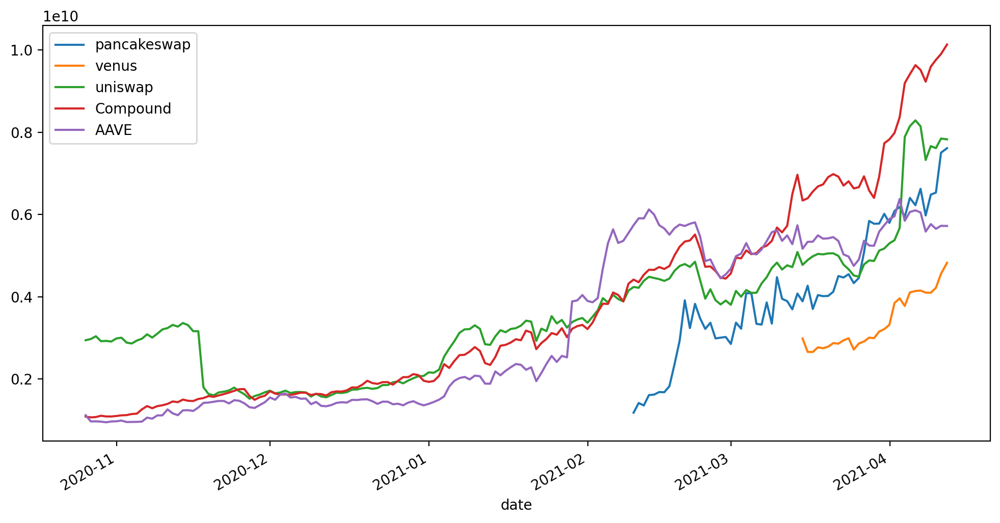

# Tools for use in DeFi

## Instalación


```sh
pip install defi
```


## Impermanent Loss

```python
import defi.defi_tools as dft

# Impermanent loss for stableCoin & -20% return token 
dft.iloss(0.8)

# >>> -0.62%

```


```python
import defi.defi_tools as dft

# Impermanent loss for stableCoin & +60% return token 
dft.iloss(1.6)

# >>> -2.7%

```


## Buy&Hold vs Stake & Farming strategy


```python
import defi.defi_tools as dft

dft.compare(days=20, var_A=0, var_B=150, rw_pool_A=0.01, rw_pool_B=0.05, rw_pool_AB=0.2, fees_AB=0.01)
```

```json
{
 "buy_hold": "75.00%",
 "stake": "75.60%",
 "farm": "71.96%",
 "Mejor Estrategia": "Stake"
}
```


## DeFi protocols


```python
import defi.defi_tools as dft

metadata, df = dft.getProtocol('Uniswap')
metadata
```

```json
{
 "id": "1",
 "name": "Uniswap",
 "address": "0x1f9840a85d5af5bf1d1762f925bdaddc4201f984",
 "symbol": "UNI",
 "url": "https://info.uniswap.org/",
 "description": "A fully decentralized protocol for automated liquidity provision on Ethereum.\r\n",
 "chain": "Ethereum",
 "logo": "None",
 "audits": "2",
 "audit_note": "None",
 "gecko_id": "uniswap",
 "cmcId": "7083",
 "category": "Dexes",
 "chains": ["Ethereum"],
 "module": "uniswap.js"
}
```


## Top 20 dapps TVL by chain

```python
import defi.defi_tools as dft
import matplotlib.pyplot as plt

df = dft.getProtocols()
fig, ax = plt.subplots(figsize=(12,6))
top_20 = df.sort_values('tvl', ascending=False).head(20)

chains = top_20.groupby('chain').size().index.values.tolist()
for chain in chains:
    filtro = top_20.loc[top_20.chain==chain]
    ax.bar(filtro.index, filtro.tvl, label=chain)

ax.set_title('Top 20 dApp TVL, groupBy dApp main Chain', fontsize=14)
plt.legend()
plt.xticks(rotation=90)
plt.show()
```



```python
import defi.defi_tools as dft
import pandas as pd

exchanges = ['pancakeswap', 'venus', 'uniswap','Compound', 'AAVE']

hist = [dft.getProtocol(exchange)[1] for exchange in exchanges]
df = pd.concat(hist, axis=1)
df.columns = exchanges
df.plot(figsize=(12,6))
```



## About

- twitter user @JohnGalt_is_www