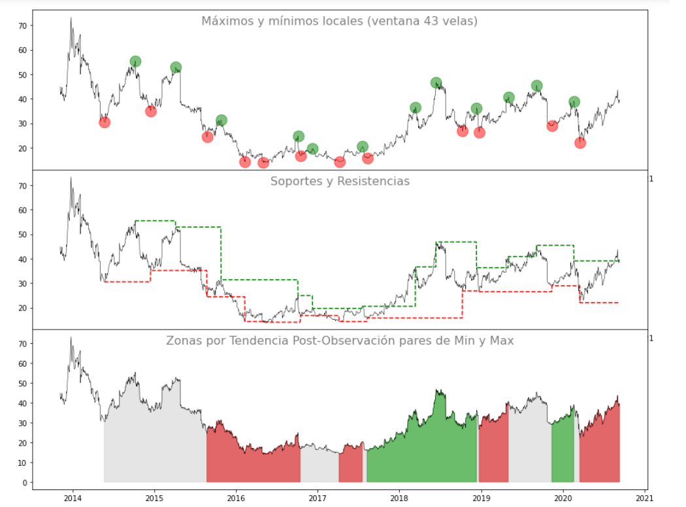
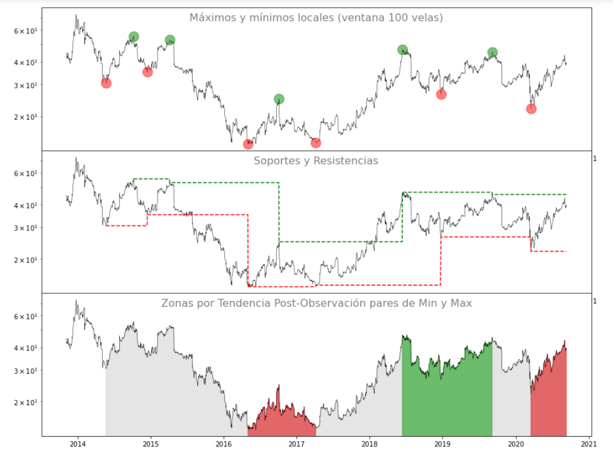
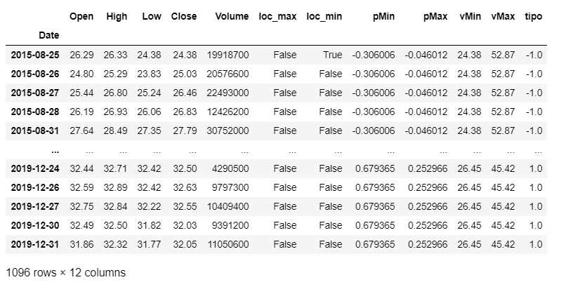
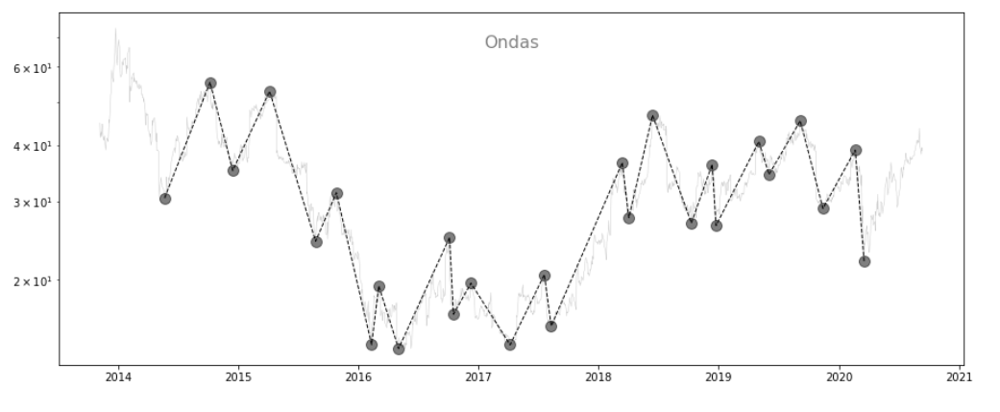

# Libreria de ejemplo curso Ullua
<br><br>

Esta librería tiene como finalidad empezar a generar contenido de los scripts que vayan armando los alumnos del curso de python para traders de @Ullua  https://twitter.com/Ullua

<br><br>
## Instalación


```sh
pip install juanpy
```


<br><br>
## Ejemplo para ubicar máximos y mínimos locales

  * Gráfico 1: 
      Precios de cierre con mínimos y máximos encontrados
  
  * Grafico 2: Precios de cierre con lineas de soportes y resistencias desde cada máximo y mínimo encontrado
  
  * Gráfico 3: Precios de cierre con zona alcista, bajista o lateral 
      En función de las pendientes de los últimos pares de mínimos y máximos encontrados 


```python
import juanpy

juanpy.trends(ticker='TWTR')
```

<div align="center">
  
</div>

<br><br>

### Ejemplo con cambio de escala y cambio de sensibilidad, y parámetros:
<br>La sensibilidad la tomará en cantidad de velas para encontrar nuevos máximos y/o mínimos locales

```python
import juanpy

df = juanpy.trends('TWTR', start='2014-06-01', end='2020-01-01', sensibilidad=60, escala='log')
```

<div align="center">
  
</div>


<br>Devuelve un dataframe con 
* los valores de máximos y mínimos vigentes a cada fecha (vMin y vMax) 
* las pendientes resultantes de unir los dos úlitmos mínimos y los dos últimos máximmos (pMin y pMax) apto apra canales
* La tendencia a partir de las pendientes de los últimos máximos y mínimos en cada punto (-1 para bajista, 0 para lateral y 1 para alcista)

<div align="center">
  
</div>

## Ejemplo para graficar ondas

Interpola máximos y mínimos de una manera mas suavizada basado en el script de las tendencias


```python
import juanpy

juanpy.waves('TWTR', sensibilidad=60, escala='log')
```
<div align="center">
  
</div>

## Créditos

Utilizamos las librerías:
- yfinance https://github.com/ranaroussi/yfinance
- pandas https://github.com/pandas-dev/pandas
- matplotlib https://github.com/matplotlib/matplotlib
